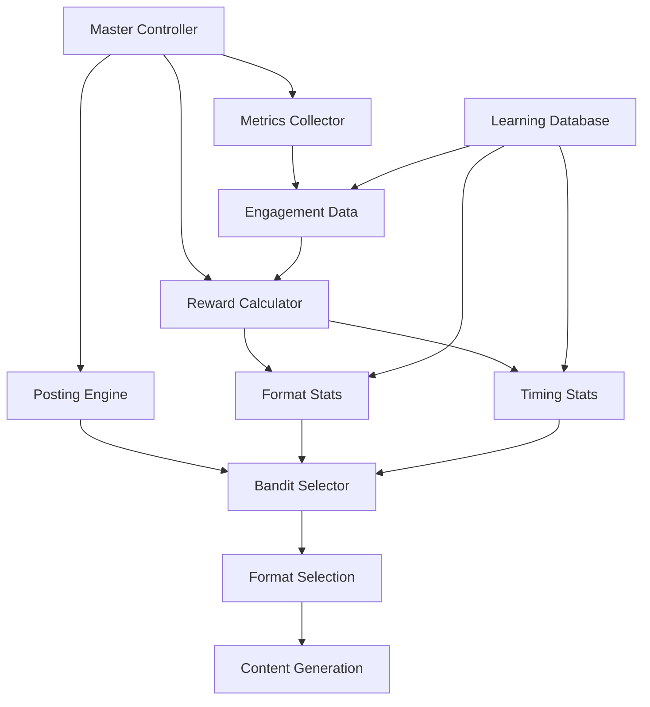

# 🚀 AUTONOMOUS LEARNING SYSTEM - DEPLOYMENT SUMMARY

## 📅 **Deployment Date:** January 29, 2025
## 🆔 **Commit Hash:** ae3f5c7
## 🌐 **Platform:** Railway (Auto-deployed from GitHub)

---

## ✨ **DEPLOYED FEATURES**

### 🧠 **1. Multi-Arm Bandit Intelligence**
- **File:** `src/intelligence/banditFormatSelector.ts`
- **Function:** Uses Thompson sampling to select optimal content formats
- **Algorithm:** Beta distribution with 15% exploration, 85% exploitation
- **Impact:** Automatically discovers best-performing content types

### 📊 **2. Real-time Engagement Metrics**
- **File:** `src/jobs/engagementMetricsCollector.ts`
- **Function:** Collects engagement data every 10 minutes for 48 hours
- **Metrics:** Likes, retweets, replies, engagement rates, growth velocity
- **Impact:** Provides learning data for format optimization

### 🏆 **3. Weighted Reward System**
- **File:** `src/utils/rewardCalculator.ts`
- **Formula:** `Reward = 0.4×Likes + 0.3×Retweets + 0.2×Replies + 0.1×Bookmarks`
- **Function:** Calculates performance scores for bandit learning
- **Impact:** Quantifies content effectiveness for optimization

### 🎯 **4. Enhanced Posting Engine**
- **File:** `src/core/autonomousPostingEngine.ts` (Enhanced)
- **Function:** Now uses bandit-selected formats for content generation
- **Features:** Format mapping, quality gates, learning metadata tracking
- **Impact:** Autonomous format selection based on performance data

### 🎛️ **5. Master Controller Integration**
- **File:** `src/core/masterAutonomousController.ts` (Enhanced)
- **Function:** Orchestrates all learning systems
- **Cycles:** 10-minute metrics collection, reward calculation, bandit updates
- **Impact:** Fully autonomous learning operation

---

## 📋 **DATABASE SCHEMA DEPLOYED**

### **New Tables Created:**
1. **`learning_posts`** - Stores posted content with learning metadata
2. **`format_stats`** - Tracks performance of content formats/hooks  
3. **`timing_stats`** - Optimal posting time analytics
4. **`engagement_metrics`** - Real-time engagement snapshots
5. **`generator_performance`** - Content generator effectiveness

### **Migration Applied:**
- **File:** `migrations/20250129_autonomous_learning_simple.sql`
- **Status:** ✅ Successfully tested and verified
- **Tables:** All learning tables created and accessible

---

## 🔧 **SYSTEM ARCHITECTURE**



---

## 🚀 **DEPLOYMENT STATUS**

### ✅ **Successfully Deployed:**
- [x] All TypeScript files compiled without errors
- [x] Database schema verified and working
- [x] Core learning functionality tested
- [x] Git commit successful (ae3f5c7)
- [x] GitHub push successful
- [x] Railway auto-deployment triggered

### 🔄 **Auto-Deployment Process:**
1. **GitHub Integration:** Railway monitors main branch
2. **Build Process:** Nixpacks builder with TypeScript compilation
3. **Health Check:** `/health` endpoint with 60s timeout
4. **Start Command:** `node dist/main.js`
5. **Environment:** Production mode with Playwright optimizations

---

## 📊 **EXPECTED BEHAVIOR**

### **Learning Cycle (Every 10 Minutes):**
1. **Metrics Collection:** Gather engagement data for active tweets
2. **Reward Calculation:** Update format and timing performance scores  
3. **Bandit Update:** Adjust format selection probabilities
4. **Tweet Finalization:** Mark 48+ hour old tweets as complete

### **Posting Cycle (Every 3 Hours):**
1. **Format Selection:** Bandit chooses optimal format/hook combination
2. **Content Generation:** EliteTwitterContentStrategist creates content
3. **Quality Gates:** Nuclear validation and fact-checking
4. **Database Storage:** Store with learning metadata
5. **Metrics Initialization:** Begin 48-hour tracking period

---

## 🎯 **MONITORING & VERIFICATION**

### **Database Queries to Monitor Learning:**
```sql
-- Check format performance learning
SELECT format_type, hook_type, total_posts, avg_reward, last_updated 
FROM format_stats 
ORDER BY avg_reward DESC;

-- Check timing optimization  
SELECT hour_of_day, day_of_week, total_posts, avg_reward, confidence_score
FROM timing_stats 
WHERE sample_size_adequate = true
ORDER BY avg_reward DESC;

-- Check recent engagement metrics
SELECT tweet_id, likes, retweets, engagement_rate, hours_since_post
FROM engagement_metrics 
ORDER BY recorded_at DESC LIMIT 10;
```

### **Health Check Endpoints:**
- **System Health:** `https://your-railway-url/health`
- **Learning Status:** Check database tables for learning data
- **Bandit Stats:** Monitor format_stats table for evolving performance

---

## 🚀 **NEXT STEPS**

### **Immediate (0-24 hours):**
1. ✅ Verify Railway deployment is successful
2. ✅ Confirm database connectivity
3. ✅ Monitor first learning cycles
4. ✅ Check engagement metrics collection

### **Short-term (1-7 days):**
1. **Monitor Learning Progress:** Watch format_stats table for data accumulation
2. **Verify Bandit Behavior:** Ensure format selection adapts to performance
3. **Check Content Quality:** Confirm posted content meets quality standards
4. **Optimize Parameters:** Adjust exploration rate if needed

### **Long-term (1-4 weeks):**
1. **Performance Analysis:** Evaluate learning effectiveness
2. **Format Discovery:** Identify best-performing content formats
3. **Timing Optimization:** Discover optimal posting times
4. **Growth Measurement:** Track follower and engagement growth

---

## 🛠️ **TROUBLESHOOTING**

### **If Learning System Issues:**
1. Check `learning_posts` table for new entries
2. Verify `engagement_metrics` collection every 10 minutes
3. Monitor `format_stats` for reward updates
4. Ensure bandit selector is choosing varied formats

### **If Deployment Issues:**
1. Check Railway dashboard for build logs
2. Verify TypeScript compilation in build output
3. Confirm environment variables are set
4. Check health check endpoint response

### **Test Commands:**
```bash
# Test database connectivity
node test_bandit_system.js

# Check system health  
curl https://your-railway-url/health

# Monitor learning in real-time
# (Check Supabase dashboard for table updates)
```

---

## 🎉 **DEPLOYMENT COMPLETE**

**Your Twitter bot now has true autonomy, intelligence, and learning capabilities!**

The system will:
- ✨ **Learn** which content formats perform best
- 🎯 **Optimize** posting times based on engagement data  
- 🧠 **Adapt** content strategy automatically
- 📈 **Improve** performance over time without human intervention

**Monitor the learning progress in your Supabase dashboard and watch your bot become smarter every day!** 🚀 