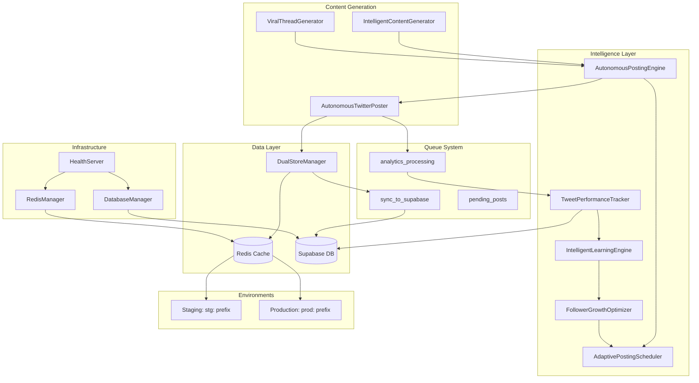

# xBOT System Architecture

**Generated**: 2025-08-11  
**Version**: Current Production System Analysis

## High-Level System Map



## Component Breakdown

### Content Generation Layer
- **IntelligentContentGenerator**: AI-powered content creation with context awareness
- **ViralThreadGenerator**: Specialized thread content with engagement optimization
- **AutonomousTwitterPoster**: Browser-based posting with Playwright integration

### Intelligence & Learning
- **AutonomousPostingEngine**: Central orchestrator for posting decisions
- **AdaptivePostingScheduler**: Timing optimization based on engagement patterns
- **TweetPerformanceTracker**: Real-time metrics collection and analysis
- **IntelligentLearningEngine**: Pattern recognition and strategy adaptation
- **FollowerGrowthOptimizer**: Growth-focused content and timing decisions

### Data Storage Architecture

#### Redis (Hot Path)
- **Prefix Isolation**: `stg:` for staging, `prod:` for production
- **Queue Management**: Priority-based queues with retry logic
- **Caching**: Configuration, analytics, rate limits
- **Deduplication**: Content hashes with TTL

#### Supabase (Durable Truth)
- **Core Tables**: tweets, bot_config, daily_summaries, audit_log, system_health
- **JSONB Strategy**: Flexible schema with structured metadata
- **Environment Separation**: Row-level environment column

### Queue System
1. **sync_to_supabase**: Redis → Supabase background sync
2. **analytics_processing**: Metrics collection and processing
3. **pending_posts**: Scheduled posts awaiting publication

## Data Flow Patterns

### Posting Flow
```
ContentGenerator → PostingEngine → DualStoreManager → Redis Cache → Poster
                                                   → SyncQueue → Supabase
```

### Analytics Flow
```
TwitterAPI → PerformanceTracker → Supabase.tweets.analytics
                                → LearningEngine → Configuration Updates
```

### Learning Loop
```
HistoricalData → PatternAnalysis → StrategyAdjustment → FutureContent
```

## Environment Strategy

### Staging Path
- Local development targets staging
- Environment: `APP_ENV=staging`
- Redis prefix: `stg:`
- Live posting: `LIVE_POSTS=false`
- Database: Staging Supabase project

### Production Path
- Railway deployment targets production
- Environment: `APP_ENV=production`
- Redis prefix: `prod:`
- Live posting: `LIVE_POSTS=true`
- Database: Production Supabase project

## Key Integrations

### Twitter API
- Posting via browser automation (Playwright)
- Metrics collection via API endpoints
- Rate limiting and compliance

### Redis Cloud
- Single instance with namespace separation
- Priority queues with persistence
- Health monitoring and fallback

### Supabase
- Multi-environment projects
- Row-level security by environment
- Real-time subscriptions for analytics

## Reliability Features

### Fault Tolerance
- Redis fallback to direct Supabase
- Retry mechanisms in queue processing
- Health checks across all services

### Schema Safety
- Migration-based database changes
- Schema version guards at startup
- JSONB for flexible evolution

### Rate Limiting
- Multi-level rate limiting (API, posting, processing)
- Redis-backed counters with TTL
- Emergency brake mechanisms

## Current Gaps for V2

1. **Bandit Algorithm**: No Thompson sampling for content optimization
2. **Model-based Scoring**: Limited logistic regression for content ranking
3. **Real-time Learning**: Async learning loop not fully implemented
4. **Advanced Queuing**: Missing candidate generation and scoring queues
5. **Safety Guards**: Basic profanity filtering needs enhancement
6. **Performance Views**: Limited SQL analytics views