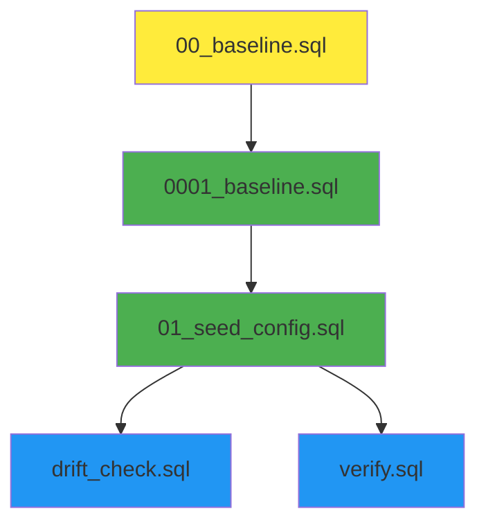

# xBOT Migrations Audit

**Generated**: 2025-08-11  
**Source**: Analysis of `supabase/migrations/` directory

## Migration Inventory

### Current Migration Files

| File | Size | Purpose | Safety Level | Dependencies |
|------|------|---------|--------------|--------------|
| `00_baseline.sql` | 4.3KB | Initial legacy structure | ⚠️ Legacy | None |
| `0001_baseline.sql` | 8.4KB | Core 5-table foundation | ✅ Safe | None |
| `01_seed_config.sql` | 3.8KB | Configuration seeding | ✅ Safe | 0001_baseline.sql |
| `drift_check.sql` | 6.5KB | Schema validation queries | ✅ Read-only | 0001_baseline.sql |
| `verify.sql` | 3.2KB | Post-migration verification | ✅ Read-only | 0001_baseline.sql |

### Migration Execution Order



**Legend**:
- 🟡 Legacy (needs review)
- 🟢 Production-safe
- 🔵 Verification-only

## Detailed Migration Analysis

### 00_baseline.sql (Legacy)
**Status**: ⚠️ Legacy migration with potential conflicts

**Contents**:
- Creates basic table structure
- Uses older column naming conventions
- Limited JSONB usage
- No environment separation

**Safety Concerns**:
- Overlaps with 0001_baseline.sql
- May cause conflicts if both run
- Uses `key`/`value` columns instead of `config_key`/`config_value`

**Recommendation**: Archive or remove after verifying 0001_baseline.sql covers all functionality

### 0001_baseline.sql (Primary)
**Status**: ✅ Production-safe, idempotent

**Contents**:
```sql
-- Core 5-table foundation
1. tweets              -- Content storage with JSONB
2. bot_config          -- Configuration with environment separation  
3. daily_summaries     -- Analytics snapshots
4. audit_log           -- Event tracking
5. system_health       -- Health monitoring
```

**Safety Features**:
- `CREATE TABLE IF NOT EXISTS` for idempotency
- Safe column renames with existence checks
- Proper JSONB defaults and indexing
- Environment-aware configuration
- Audit trigger function

**Environment Handling**:
- Handles legacy column names gracefully
- Adds missing columns safely
- Creates unique constraints before data insertion

### 01_seed_config.sql (Configuration)
**Status**: ✅ Production-safe, idempotent

**Contents**:
- Seeds essential configuration for production and staging
- Uses proper JSONB formatting with `jsonb_build_object()`
- Implements ON CONFLICT handling for re-runs

**Configuration Keys Seeded**:
```sql
-- Production environment
schema_version          -- Version: 1.0.0
redis_config           -- TTL: 3600, memory: 256mb
rate_limits            -- 12/hour, 75/day, 100/minute
feature_flags          -- autonomous_posting: true

-- Staging environment  
schema_version          -- Version: 1.0.0 (same)
redis_config           -- TTL: 1800, memory: 128mb (smaller)
rate_limits            -- 6/hour, 25/day, 50/minute (conservative)
feature_flags          -- autonomous_posting: false (safe)
```

## Schema Consistency Analysis

### Baseline Compliance
✅ **All required tables present**:
- tweets ✓
- bot_config ✓  
- daily_summaries ✓
- audit_log ✓
- system_health ✓

### Column Consistency

#### tweets table
| Column | Type | Baseline | 0001_baseline | Status |
|--------|------|----------|---------------|---------|
| id | BIGSERIAL | ✓ | ✓ | ✅ Match |
| tweet_id | TEXT UNIQUE | ✓ | ✓ | ✅ Match |
| content | TEXT | ✓ | ✓ | ✅ Match |
| posted_at | TIMESTAMPTZ | ✓ | ✓ | ✅ Match |
| platform | TEXT | ✓ | ✓ | ✅ Match |
| metadata | JSONB | ✓ | ✓ | ✅ Match |
| analytics | JSONB | ✓ | ✓ | ✅ Match |

#### bot_config table
| Column | Legacy Name | Current Name | Migration Handling |
|--------|-------------|--------------|-------------------|
| config_key | key | config_key | ✅ Safe rename |
| config_value | value | config_value | ✅ Safe rename |
| environment | - | environment | ✅ Added safely |
| metadata | - | metadata | ✅ Added safely |
| updated_at | - | updated_at | ✅ Added safely |

### Index Coverage
✅ **All critical indexes present**:
- Posted date ordering: `idx_tweets_posted_at`
- Content search: GIN indexes on JSONB columns
- Constraint enforcement: Unique constraints properly defined

## Idempotency Assessment

### Safe Patterns Used
```sql
-- Table creation
CREATE TABLE IF NOT EXISTS table_name (...);

-- Column addition  
IF NOT EXISTS (SELECT 1 FROM information_schema.columns WHERE ...) THEN
    ALTER TABLE ... ADD COLUMN ...;
END IF;

-- Index creation
CREATE INDEX IF NOT EXISTS index_name ON table_name (...);

-- Data insertion with conflict handling
INSERT INTO table_name (...) VALUES (...)
ON CONFLICT ON CONSTRAINT constraint_name 
DO UPDATE SET ...;
```

### Risk Areas
⚠️ **Legacy migration (00_baseline.sql)**:
- No IF NOT EXISTS checks
- Potential conflicts with main migration
- Different column naming

## Missing Migration Gaps

### V2 Learning Engine Requirements

#### Additional Tables Needed
```sql
-- Not yet created, needed for V2
CREATE TABLE learning_metrics (
    id BIGSERIAL PRIMARY KEY,
    topic TEXT NOT NULL,
    time_bucket TEXT NOT NULL,
    alpha INTEGER DEFAULT 1,
    beta INTEGER DEFAULT 1,
    last_updated TIMESTAMPTZ DEFAULT NOW()
);

CREATE TABLE content_candidates (
    id BIGSERIAL PRIMARY KEY,
    content TEXT NOT NULL,
    topic TEXT NOT NULL,
    score DECIMAL(5,3),
    metadata JSONB DEFAULT '{}',
    created_at TIMESTAMPTZ DEFAULT NOW()
);
```

#### Additional Indexes Needed
```sql
-- Performance optimization for learning queries
CREATE INDEX idx_tweets_analytics_engagement 
ON tweets USING GIN ((analytics->'engagement_rate'));

CREATE INDEX idx_bot_config_environment_updated 
ON bot_config (environment, updated_at DESC);

CREATE INDEX idx_daily_summaries_metrics_gin
ON daily_summaries USING GIN (metrics);
```

### View Definitions Missing
```sql
-- Needed for V2 analytics
CREATE VIEW vw_recent_posts AS ...;
CREATE VIEW vw_topics_perf_7d AS ...;
CREATE VIEW vw_time_of_day_perf_7d AS ...;
```

## Migration Safety Recommendations

### Immediate Actions
1. **Archive 00_baseline.sql**: Move to `migrations/archive/` to prevent conflicts
2. **Add V2 migrations**: Create timestamped migrations for learning engine
3. **Enhance verification**: Add more comprehensive post-migration checks

### Future Migration Standards
```sql
-- Template for new migrations
-- Migration: YYYYMMDD_HH_descriptive_name.sql
-- Purpose: Brief description
-- Dependencies: Previous migration names
-- Safety: Additive-only, idempotent

BEGIN;

-- Set timeouts for safety
SET lock_timeout = '30s';
SET statement_timeout = '60s';

-- Migration content here
-- Always use IF NOT EXISTS patterns
-- Always add comments explaining purpose

-- Log migration completion
INSERT INTO audit_log (event_type, component, event_data) 
VALUES ('MIGRATION_COMPLETE', 'migration_name', '{"version": "x.y.z"}');

COMMIT;
```

### Rollback Strategy
- **Schema rollbacks**: Not supported (additive-only approach)
- **Data rollbacks**: Use audit_log for change tracking
- **Configuration rollbacks**: Update bot_config values to previous state
- **Emergency fallback**: Feature flags to disable new functionality

## CI/CD Integration

### GitHub Actions Workflow
```yaml
# Existing: .github/workflows/pr-migrations.yml
# Runs on: Migration file changes
# Environment: Staging project
# Verification: smoke.sql + verify.sql + drift_check.sql
```

### Staging Verification
- Links to staging Supabase project
- Runs all migrations in order
- Executes verification scripts
- Reports Go/No-Go status

### Production Promotion
- Manual approval required
- Links to production Supabase project  
- Applies same migration files
- Logs deployment to audit_log

## Risk Assessment

### High Risk
- ❌ **None identified** - Current migrations are well-structured

### Medium Risk  
- ⚠️ **Legacy migration conflicts**: 00_baseline.sql vs 0001_baseline.sql
- ⚠️ **Missing V2 schema**: Learning engine tables not yet defined

### Low Risk
- ✅ **Schema drift**: Handled by verification scripts
- ✅ **Data loss**: Additive-only approach prevents accidental drops
- ✅ **Environment conflicts**: Proper isolation implemented