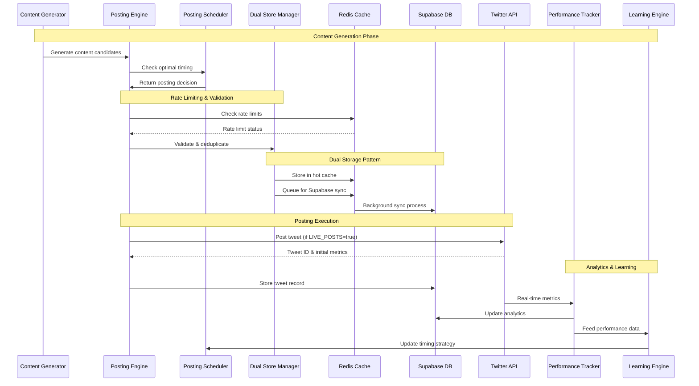

# xBOT Runtime Flow Analysis

**Generated**: 2025-08-11  
**Source**: Code analysis of posting engine and intelligence systems

## Tweet Lifecycle Overview



## Detailed Flow Breakdown

### 1. Content Generation Phase

**File**: `src/agents/intelligentContentGenerator.ts`

```typescript
// Content generation triggers
1. Scheduled interval (cron-based)
2. Manual trigger via API
3. Engagement threshold response

// Generation process
IntelligentContentGenerator.generate() →
  - Analyze recent performance
  - Select optimal content type
  - Generate multiple variants
  - Apply safety filters
  - Return ranked candidates
```

**Key Functions**:
- `generateTweet()`: Core content creation
- `analyzeEngagement()`: Performance-based optimization
- `applyContentFilters()`: Safety and compliance

### 2. Timing & Scheduling

**File**: `src/intelligence/adaptivePostingScheduler.ts`

```typescript
// Scheduling logic
AdaptivePostingScheduler.shouldPost() →
  - Check quiet hours configuration
  - Analyze historical performance by time
  - Consider follower activity patterns
  - Apply rate limiting constraints
  - Return posting recommendation
```

**Decision Factors**:
- **Time of Day**: Best performance windows based on historical data
- **Day of Week**: Weekday vs weekend engagement patterns  
- **Rate Limits**: Posts per hour/day from bot_config
- **Quiet Hours**: Configured silent periods (default: 2-5 AM)
- **Follower Activity**: Audience online patterns

### 3. Rate Limiting & Deduplication

**File**: `src/lib/dualStoreManager.ts`

```typescript
// Rate limiting flow
DualStoreManager.checkRateLimit() →
  - Query Redis counters
  - Check multiple time windows
  - Apply emergency brake if needed
  - Return limit status + remaining quota

// Deduplication flow  
DualStoreManager.checkDuplicate() →
  - Generate content hash
  - Check Redis dedup cache
  - Return duplicate status
```

**Rate Limit Windows**:
- **Per Hour**: 12 posts (production), 6 (staging)
- **Per Day**: 75 posts (production), 25 (staging)
- **Per Minute**: API call limiting for metrics collection
- **Emergency Brake**: Hard stop when limits approached

**Redis Keys Used**:
```
{prefix}rate_limit:posting:{hour}     -- Hourly post counter
{prefix}rate_limit:api:{minute}       -- API call counter  
{prefix}dedup:content:{hash}          -- Content deduplication
{prefix}lock:posting_in_progress      -- Prevent concurrent posting
```

### 4. Dual Storage Pattern

**File**: `src/lib/dualStoreManager.ts`

```typescript
// Storage flow (hot path)
1. Store in Redis for immediate access
2. Queue for background Supabase sync
3. Background worker processes sync queue
4. Handle sync failures with retry logic

// Read flow (cache-first)
1. Check Redis cache first
2. Fallback to Supabase on cache miss
3. Populate Redis cache from DB result
4. Return data to caller
```

**Queue Management**:
```typescript
interface SyncQueueItem {
  operation: 'insert' | 'update' | 'delete';
  table: string;
  data: any;
  retryCount: number;
  createdAt: Date;
}
```

### 5. Posting Execution

**File**: `src/core/autonomousPostingEngine.ts`

```typescript
// Posting execution flow
AutonomousPostingEngine.executePost() →
  - Acquire posting lock
  - Final rate limit check
  - Execute browser automation (Playwright)
  - Handle Twitter 2FA/challenges
  - Extract tweet ID from response
  - Store result in dual storage
  - Release posting lock
```

**Browser Automation** (`src/agents/autonomousTwitterPoster.ts`):
- Playwright-based Twitter interaction
- Session management and persistence
- Error recovery and retry logic
- 2FA and CAPTCHA handling

**LIVE_POSTS Environment Control**:
```typescript
if (process.env.LIVE_POSTS === 'true') {
  // Actually post to Twitter
  await this.browserPoster.postTweet(content);
} else {
  // Dry run mode - log only
  console.log('DRY RUN:', content);
}
```

### 6. Analytics Collection

**File**: `src/intelligence/tweetPerformanceTracker.ts`

```typescript
// Metrics collection flow
TweetPerformanceTracker.collectMetrics() →
  - Query Twitter API for engagement data
  - Calculate derived metrics (engagement rate)
  - Update tweet analytics in Supabase
  - Cache recent metrics in Redis
  - Trigger learning engine updates
```

**Metrics Collected**:
- **Basic**: likes, retweets, replies, bookmarks
- **Derived**: engagement_rate, performance_tier
- **Growth**: follower_count_change, attribution
- **Timing**: collection_timestamp, data_freshness

**Collection Schedule**:
- **Immediate**: Basic metrics on posting
- **15 minutes**: First engagement check
- **1 hour**: Full metrics collection
- **24 hours**: Final performance assessment

### 7. Learning Loop

**File**: `src/intelligence/intelligentLearningEngine.ts`

```typescript
// Learning process
IntelligentLearningEngine.updatePatterns() →
  - Analyze recent tweet performance
  - Identify content patterns (topic, length, timing)
  - Update content strategy weights
  - Adjust posting frequency
  - Store insights for future use
```

**Pattern Recognition**:
- **Content Types**: question, statement, list, thread, quote, fact
- **Topics**: Extract and categorize main themes
- **Timing**: Optimal posting windows by day/hour
- **Engagement Hooks**: What drives interactions

**Strategy Updates**:
- Posting schedule adjustments
- Content type preference weighting
- Topic selection optimization
- Engagement strategy refinement

## Current Gaps & V2 Enhancements

### Missing Components for V2

#### 1. Candidate Generation Pipeline
```typescript
// Not yet implemented
CandidateGenerator.generateCandidates() →
  - Trend analysis (X search + curated)
  - News summarization (gaming headlines)
  - Clip processing (local/linked manifests)
  - Generate variants per topic
  - Return ranked candidate set
```

#### 2. Thompson Sampling (Bandit Algorithm)
```typescript
// Not yet implemented  
BanditScorer.scoreCandidate() →
  - Load alpha/beta priors from Redis
  - Sample from Beta distributions
  - Calculate topic/time/tag scores
  - Update priors based on performance
  - Return exploration vs exploitation balance
```

#### 3. Model-based Scoring
```typescript
// Not yet implemented
LogisticScorer.scoreCandidate() →
  - Extract content features
  - Apply trained model weights
  - Calculate engagement probability
  - Combine with bandit scores
  - Return final ranking score
```

#### 4. Safety Guards Enhancement
```typescript
// Basic implementation exists, needs expansion
SafetyGuard.validateContent() →
  - Profanity filtering (current)
  - Secrets/sensitive data detection (current)
  - Max hashtag limits (current)
  - Sentiment analysis (missing)
  - Brand safety checks (missing)
  - Regulatory compliance (missing)
```

## Performance Bottlenecks

### Current Issues
1. **Synchronous Posting**: Blocking operations during tweet execution
2. **Single-threaded Learning**: No parallel processing of analytics
3. **Cache Misses**: Limited Redis utilization for frequently accessed data
4. **API Rate Limits**: Twitter API constraints not optimally managed

### Optimization Opportunities
1. **Async Queue Processing**: Background workers for all non-critical operations
2. **Batch Analytics**: Collect metrics for multiple tweets simultaneously  
3. **Predictive Caching**: Pre-cache likely-needed configuration and data
4. **Smart Rate Limiting**: Dynamic adjustment based on API quota usage

## Error Handling & Recovery

### Current Error Handling

#### Network Failures
- **Twitter API**: Exponential backoff with jitter
- **Supabase**: Connection pooling with retry logic
- **Redis**: Graceful fallback to direct Supabase

#### Data Integrity
- **Dual Storage**: Ensures no data loss between Redis and Supabase
- **Queue Processing**: Retry failed operations with exponential backoff
- **Audit Logging**: All operations logged for debugging

#### Rate Limit Exceeded
- **Emergency Brake**: Hard stop when approaching limits
- **Queue Backoff**: Delay operations when rate limited
- **Graceful Degradation**: Reduce posting frequency automatically

### Recovery Procedures
1. **Redis Failure**: Continue with Supabase-only mode
2. **Supabase Outage**: Queue operations in Redis for later sync
3. **Twitter API Issues**: Pause posting, continue analytics collection
4. **Browser Automation Failure**: Restart session, retry with clean state

## Health Monitoring

### Current Health Checks

**File**: `src/healthServer.ts`
- **Endpoint**: `/health` - Overall system status
- **Endpoint**: `/health/redis` - Redis connectivity
- **Endpoint**: `/health/db` - Database connectivity

**Metrics Tracked**:
- Component availability (Redis, Supabase, Twitter API)
- Queue depths and processing latency
- Rate limit utilization
- Error rates by component
- Last successful posting timestamp

### Monitoring Integration
- **Railway**: Built-in health check monitoring
- **Logs**: Structured logging with correlation IDs
- **Alerts**: Error threshold-based notifications (external setup required)