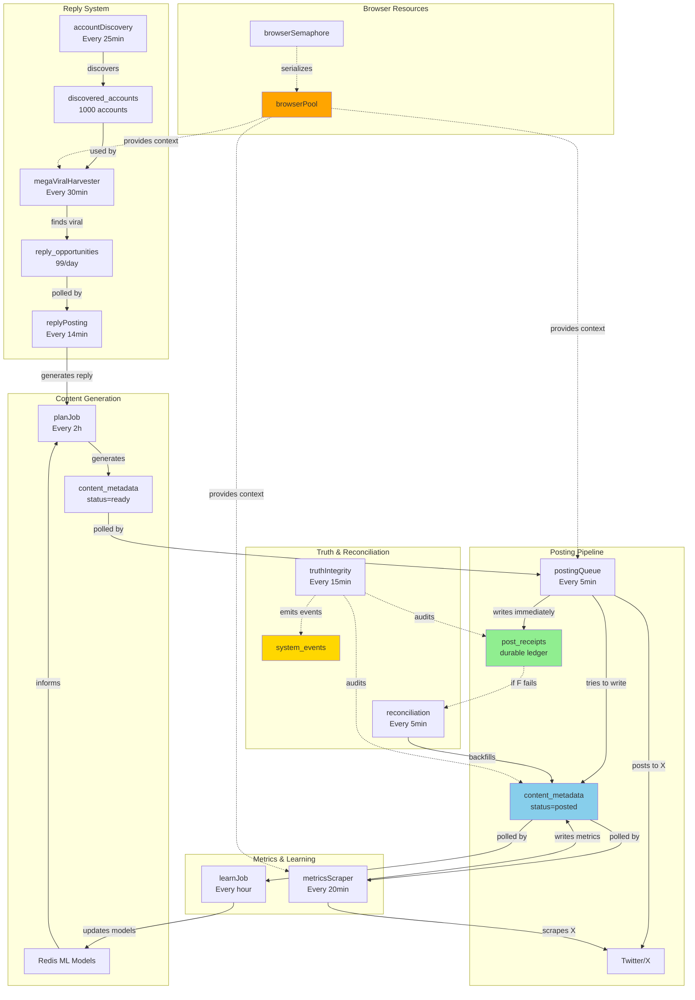
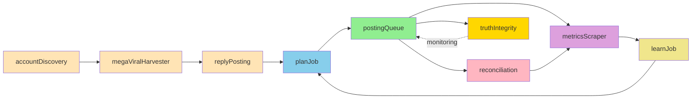

# 🗺️ SYSTEM MAP
## xBOT Autonomous Posting System Architecture
### Date: December 20, 2025

---

## 📋 COMPLETE SUBSYSTEM INVENTORY

| # | Subsystem | Code Location | Schedule | Frequency | DB Input | DB Output | Status Signal | Risk |
|---|-----------|---------------|----------|-----------|----------|-----------|---------------|------|
| 1 | **postingQueue** | `src/jobs/postingQueue.ts` | Interval | Every 5 min | `content_metadata` (status=ready) | `content_metadata` (status=posted), `post_receipts` | `[POSTING_QUEUE][SUCCESS]` | 🟢 LOW |
| 2 | **planJob** | `src/jobs/planJob.ts` | Interval | Every 2 hours | `content_metadata`, Redis ML | `content_metadata` (status=ready) | `[PLAN_JOB] completed` | 🟢 LOW |
| 3 | **megaViralHarvester** | `src/jobs/megaViralHarvesterJob.ts` | Interval | Every 30 min | `discovered_accounts`, `reply_opportunities` | `reply_opportunities` | `[HARVESTER] Harvested: X` | 🟡 MEDIUM |
| 4 | **accountDiscovery** | `src/jobs/accountDiscoveryJob.ts` | Interval | Every 25 min | `discovered_accounts` | `discovered_accounts` | `[ACCOUNT_DISCOVERY] added X` | 🟢 LOW |
| 5 | **metricsScraper** | `src/jobs/metricsScraperJob.ts` | Interval | Every 20 min | `content_metadata` (tweet_id) | `content_metadata` (actual_likes/etc) | `[METRICS_SCRAPER] scraped X` | 🟢 LOW |
| 6 | **replyPosting** | `src/jobs/replyPostingJobV2.ts` | Interval | Every 14 min | `reply_opportunities` | `content_metadata`, `post_receipts` | `[REPLY_POSTING] posted X` | 🟢 LOW |
| 7 | **truthIntegrity** | `src/jobs/truthIntegrityJob.ts` | Interval | Every 15 min | `content_metadata`, `post_receipts` | `system_events` | `[TRUTH_VERIFY] verdict=PASS/FAIL` | 🟢 LOW |
| 8 | **reconciliation** | `src/jobs/reconcileDecisionJob.ts` | Interval | Every 5 min | `post_receipts`, `content_metadata` | `content_metadata` | `[RECONCILE_JOB]` | 🟢 LOW |
| 9 | **analytics** | `src/jobs/analyticsCollectorJobV2.ts` | Interval | Every 6 hours | `content_metadata`, Twitter API | `follower_snapshots` | `[ANALYTICS]` | 🟢 LOW |
| 10 | **learning** | `src/jobs/learnJob.ts` | Interval | Every hour | `content_metadata` (metrics) | Redis ML models | `[LEARN_JOB]` | 🟢 LOW |
| 11 | **browserPool** | `src/browser/UnifiedBrowserPool.ts` | On-demand | N/A | N/A | Playwright contexts | `[BROWSER_POOL]` | 🟡 MEDIUM |
| 12 | **browserSemaphore** | `src/browser/BrowserSemaphore.ts` | On-demand | N/A | N/A | Operation queue | `[BROWSER_SEM]` | 🟡 MEDIUM |
| 13 | **syncFollower** | `src/jobs/syncFollowerDataJob.ts` | Interval | Every 30 min | `follower_snapshots` | `follower_snapshots` | `[SYNC_FOLLOWER]` | 🟢 LOW |
| 14 | **velocityTracker** | `src/jobs/velocityTrackerJob.ts` | Interval | Every 6 hours (with analytics) | Twitter API | `follower_snapshots` | `[VELOCITY_TRACKER]` | 🟢 LOW |

---

## 🌊 PIPELINE FLOW DIAGRAM



---

## 📊 DATA FLOW TABLE

### **Primary Tables**

| Table | Purpose | Written By | Read By | Row Count (approx) | Retention |
|-------|---------|------------|---------|-------------------|-----------|
| `content_metadata` | Single source of truth for all content | `planJob`, `postingQueue`, `metricsScraper` | All jobs | ~3,000 | Indefinite |
| `post_receipts` | Immutable ledger of posted tweets | `postingQueue` | `reconciliation`, `truthIntegrity`, `rateLimiter` | ~2,000 | Indefinite |
| `reply_opportunities` | Viral tweets to reply to | `megaViralHarvester` | `replyPosting` | ~150 | 36 hours |
| `discovered_accounts` | High-quality accounts to harvest from | `accountDiscovery` | `megaViralHarvester` | 1,000 | Indefinite |
| `system_events` | Structured event log | All jobs | `truthIntegrity`, monitoring | ~10,000 | 30 days |
| `follower_snapshots` | Follower count tracking | `analytics`, `velocityTracker` | `learning` | ~1,000 | Indefinite |

---

## 🔄 JOB DEPENDENCIES



---

## 🚦 FAILURE MODES

| Subsystem | Failure Mode | Symptoms | Impact | Detection | Recovery |
|-----------|-------------|----------|--------|-----------|----------|
| **postingQueue** | Browser timeout | No `[SUCCESS]` logs | Content not posted | `[BROWSER_SEM][TIMEOUT]` | Retry on next cycle |
| **postingQueue** | DB save failure | Orphan receipts | Learning pipeline missing data | Truth audit: orphan count > 0 | Reconciliation job |
| **planJob** | LLM API failure | No new content generated | Queue empties | `[PLAN_JOB] error` | Retry on next cycle |
| **megaViralHarvester** | Browser pool overload | `Queue timeout` | No new opportunities | `[HARVESTER] 0 new` | Reduce background load |
| **accountDiscovery** | X rate limit | No new accounts | Harvester starved | `[ACCOUNT_DISCOVERY] error` | Backoff + retry |
| **metricsScraper** | Tweet deleted | Scrape fails for specific ID | Metrics missing for 1 tweet | `[METRICS_SCRAPER] error` | Skip + continue |
| **reconciliation** | Decision not found | Can't backfill orphan | Orphan persists | `[RECONCILE_JOB] not found` | Manual investigation |
| **truthIntegrity** | Repeated failures | 3+ FAILs in 60min | Posting paused (truth guard) | `[TRUTH_GUARD] posting_paused` | Fix violations |
| **browserPool** | Memory leak | Increasing memory usage | System slowdown | `[BROWSER_POOL] reset` | Pool reset + restart |
| **browserSemaphore** | Deadlock | All operations timeout | System frozen | No logs for >10min | Service restart |

---

## 📈 SCALABILITY LIMITS

| Resource | Current Limit | Bottleneck | Scale-Up Path |
|----------|---------------|------------|---------------|
| **Browser instances** | 1 shared | All browser operations | Add 2nd Railway service for harvesting |
| **Concurrent operations** | 2 | Browser pool queue | Increase to 3-4 (test memory first) |
| **Posting rate** | 2/hour (by design) | Twitter TOS | Cannot increase without risk |
| **Reply rate** | 4/hour (by design) | Twitter TOS | Cannot increase without risk |
| **Database connections** | Unlimited (Supabase pooler) | None | N/A |
| **Redis memory** | 50MB (Railway) | ML model size | Upgrade plan if needed |
| **LLM API rate** | 10K TPM (OpenAI) | Content generation | Upgrade tier if needed |

---

## 🔍 OBSERVABILITY

### **Key Metrics to Monitor**

| Metric | Source | Query | Healthy Range | Alert Threshold |
|--------|--------|-------|---------------|-----------------|
| **Posting rate** | `post_receipts` | `SELECT COUNT(*) FROM post_receipts WHERE posted_at > NOW() - INTERVAL '1 hour'` | 1-3/hour | <1 or >5 |
| **Truth gap** | `post_receipts` + `content_metadata` | See audit script | 0 orphans | >5 orphans |
| **Metrics coverage** | `content_metadata` | `SELECT ... WHERE actual_likes IS NOT NULL` | >80% | <50% |
| **Harvester yield** | `reply_opportunities` | `SELECT COUNT(*) ... WHERE created_at > NOW() - INTERVAL '24 hours'` | 20-100/day | <10 |
| **Queue backlog** | `content_metadata` | `SELECT COUNT(*) WHERE status IN ('ready', 'pending')` | <10 items | >50 items |
| **Stale items** | `content_metadata` | `SELECT ... WHERE created_at < NOW() - INTERVAL '6 hours'` | 0 stale | >3 stale |
| **Browser queue depth** | Logs | `grep "BROWSER_POOL.*queue"` | <5 operations | >10 operations |
| **Job heartbeats** | `system_events` | `SELECT ... WHERE event_type = 'job_success'` | All jobs in last hour | Any job missing >2h |

---

## 🛠️ MAINTENANCE CHECKLIST

### **Daily:**
- ✅ Run `pnpm audit:health`
- ✅ Check for truth gaps (orphan receipts)
- ✅ Verify posting rate (should be ~48/day)
- ✅ Check Railway logs for errors

### **Weekly:**
- ✅ Review metrics coverage (>80%)
- ✅ Check harvester yield (>140/week)
- ✅ Verify account discovery (>35/week)
- ✅ Review learning pipeline performance

### **Monthly:**
- ✅ Audit database size + optimize
- ✅ Review and prune old `system_events`
- ✅ Check for memory leaks
- ✅ Update dependencies

---

## 🎯 SYSTEM DIAGRAM (High-Level)

```
┌─────────────────────────────────────────────────────────────────┐
│                        xBOT SYSTEM                              │
│                                                                 │
│  ┌──────────────┐     ┌──────────────┐     ┌──────────────┐  │
│  │   Content    │────▶│   Posting    │────▶│   Twitter    │  │
│  │  Generation  │     │   Pipeline   │     │      /X      │  │
│  │  (planJob)   │     │(postingQueue)│     │              │  │
│  └──────────────┘     └──────────────┘     └──────────────┘  │
│         │                     │                     │         │
│         │                     ▼                     │         │
│         │              ┌──────────────┐             │         │
│         │              │ Post Receipts│             │         │
│         │              │ (Truth Ledger│             │         │
│         │              └──────────────┘             │         │
│         │                     │                     │         │
│         │                     ▼                     │         │
│         │              ┌──────────────┐             │         │
│         │              │Reconciliation│             │         │
│         │              │    (Healer)  │             │         │
│         │              └──────────────┘             │         │
│         │                                           │         │
│         │                                           ▼         │
│         │                                    ┌──────────────┐ │
│         │                                    │   Metrics    │ │
│         │                                    │   Scraper    │ │
│         │                                    └──────────────┘ │
│         │                                           │         │
│         │                                           ▼         │
│         │              ┌──────────────────────────────────┐  │
│         └──────────────│    Learning Pipeline (ML)       │  │
│                        │  (Improves content over time)   │  │
│                        └──────────────────────────────────┘  │
│                                                                 │
│  ┌──────────────┐     ┌──────────────┐     ┌──────────────┐  │
│  │   Account    │────▶│    Viral     │────▶│    Reply     │  │
│  │  Discovery   │     │  Harvester   │     │   Posting    │  │
│  │              │     │              │     │              │  │
│  └──────────────┘     └──────────────┘     └──────────────┘  │
│                                                                 │
│                                                                 │
│  ┌────────────────────────────────────────────────────────┐   │
│  │          Browser Pool (Shared Resource)                │   │
│  │  • 1 Chromium instance                                 │   │
│  │  • 2 concurrent operations max                         │   │
│  │  • Priority queue (posting > metrics > harvesting)     │   │
│  └────────────────────────────────────────────────────────┘   │
│                                                                 │
└─────────────────────────────────────────────────────────────────┘
```

---

## 📋 QUICK REFERENCE

### **Common Commands:**
```bash
# Health check
pnpm audit:health

# Run reconciliation
pnpm truth:reconcile:last24h

# Verify threads
pnpm verify:thread

# Check replies
pnpm debug:replies:last60m

# Database doctor
pnpm db:doctor

# Apply migrations
pnpm db:migrate
```

### **Common Queries:**
```sql
-- Check posting rate (last hour)
SELECT COUNT(*) FROM post_receipts 
WHERE posted_at > NOW() - INTERVAL '1 hour';

-- Check for truth gaps
SELECT COUNT(*) FROM post_receipts r
LEFT JOIN content_metadata cm ON r.decision_id = cm.decision_id AND cm.status = 'posted'
WHERE r.posted_at > NOW() - INTERVAL '24 hours' AND cm.decision_id IS NULL;

-- Check metrics coverage
SELECT 
  COUNT(*) as total,
  SUM(CASE WHEN actual_likes IS NOT NULL THEN 1 ELSE 0 END) as with_metrics
FROM content_metadata
WHERE status = 'posted' AND posted_at > NOW() - INTERVAL '24 hours';

-- Check queue backlog
SELECT COUNT(*) FROM content_metadata
WHERE status IN ('pending', 'ready', 'queued');
```

### **Log Patterns:**
```bash
# Posting success
railway logs | grep "\[POSTING_QUEUE\]\[SUCCESS\]"

# Harvester yield
railway logs | grep "\[HARVESTER\] Harvested:"

# Browser pool issues
railway logs | grep "pool overloaded\|Queue timeout"

# Truth integrity
railway logs | grep "\[TRUTH_VERIFY\]"
```

---

**This system map is the definitive reference for understanding xBOT's architecture, data flows, and operational characteristics.**

